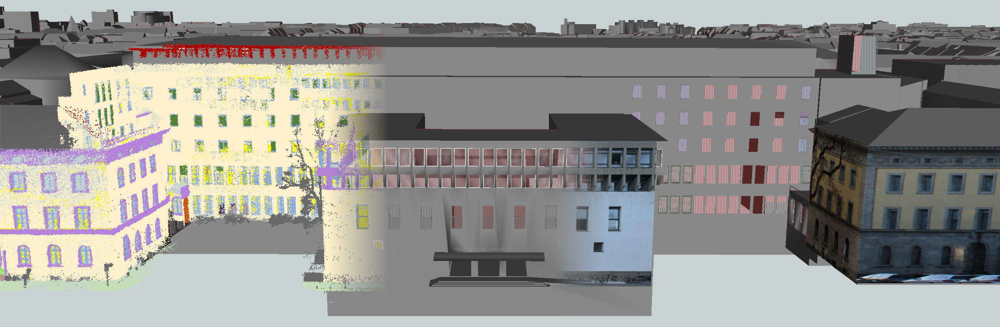

<a href="https://www.tum.de/en/">
  
</a>

# tum2twin

This repository contains [CityGML](https://www.ogc.org/standard/citygml/) LOD3 models of the [Technical University of Munich](https://www.tum.de/en/).




## 🚀 Getting Started

The datasets are stored on a dedicated [GitLab repository](https://gitlab.lrz.de/tum-gis/tum2twin-datasets).
To clone the repo, make sure to have [Git LFS](https://git-lfs.com/) installed and run:

```bash
git clone --depth 1 git@gitlab.lrz.de:tum-gis/tum2twin-datasets.git
```

The tum2twin-dataset repository contains:

- CityGML
  - [lod2-building-datasets](https://gitlab.lrz.de/tum-gis/tum2twin-datasets/-/tree/main/citygml/lod2-building-datasets): LOD2 building models of the [Bavarian State Office for Digitizing, Broadband and Survey (LDBV)](https://geodaten.bayern.de/opengeodata/OpenDataDetail.html?pn=lod2)
  - [lod2-textured-building-datasets](https://gitlab.lrz.de/tum-gis/tum2twin-datasets/-/tree/main/citygml/lod2-textured-building-datasets): LOD2 textured building models
  - [lod3-building-datasets](https://gitlab.lrz.de/tum-gis/tum2twin-datasets/-/tree/main/citygml/lod3-building-datasets): Exported CityGML v2 LOD3 building models
  - [lod3-vegetation-datasets](https://gitlab.lrz.de/tum-gis/tum2twin-datasets/-/tree/main/citygml/lod3-vegetation-datasets): Trees modelled using [this workflow](https://github.com/SabineZa/Automatic_Tree_Cadastre)
- OpenDRIVE
  - [openDrive Map](https://gitlab.lrz.de/tum-gis/tum2twin-datasets/-/tree/main/opendrive/lod3_road_models): OpenDRIVE Map for the central campus area (work in progress)
- SketchUp
  - [lod2-textured-building-projects](https://gitlab.lrz.de/tum-gis/tum2twin-datasets/-/tree/main/sketchup/lod2-textured-building-projects): LOD2 SketchUp projects for texturing the building models
  - [lod3-building-projects](https://gitlab.lrz.de/tum-gis/tum2twin-datasets/-/tree/main/sketchup/lod3-building-projects): SketchUp projects modelled according to [this guideline](https://creating-citygml-datasets.readthedocs.io/en/latest/creation-guidelines/lod3-models-based-on-point-clouds.html)

The file names follow the GML IDs of the [LDBV](https://geodaten.bayern.de/opengeodata/OpenDataDetail.html?pn=lod2).

## 👓 Visuals

[[3D web visualisation (beta of Ch. Beil)](https://www.3dcitydb.net/3dcitydb-web-map/2.0.0/3dwebclient/?t=tum2twin&s=false&ts=0&la=48.146631&lo=11.569777&h=701.398&hd=323.05&p=-37.61&r=0&l_0=u%3Dhttps%253A%252F%252Fwww.3dcitydb.org%252F3dcitydb%252Ffileadmin%252Fpublic%252F3dwebclientprojects%252Ftum-playground%252Flod3_textured%252Ftileset.json%26n%3DBuildings%2520LOD3%26ld%3DCesium%25203D%2520Tiles%26lp%3D%26lc%3D%26gv%3D%26a%3Dtrue%26tdu%3D%26ds%3DGoogleSheets%26tt%3DHorizontal%26gc%3D%26il%3D%26al%3D%26ac%3D%26av%3D&l_1=u%3Dhttps%253A%252F%252Fwww.3dcitydb.org%252F3dcitydb%252Ffileadmin%252Fpublic%252F3dwebclientprojects%252FmunichCenter%252Fvegetation-glTF%252Fvege_collada_MasterJSON.json%26n%3DVegetation%26ld%3DCOLLADA%252FKML%252FglTF%26lp%3Dfalse%26lc%3Dfalse%26gv%3D2.0%26a%3Dtrue%26tdu%3D%26ds%3DGoogleSheets%26tt%3DHorizontal%26gc%3D%26il%3D120%26al%3D1.7976931348623157e%252B308%26ac%3D50%26av%3D200&l_2=u%3Dhttps%253A%252F%252Fwww.3dcitydb.net%252F3dcitydb%252Ffileadmin%252Fpublic%252F3dwebclientprojects%252Ftum_clearancespace%252Fpointcloud%252Ftileset.json%26n%3DPointcloud%26ld%3DCesium%25203D%2520Tiles%26lp%3D%26lc%3D%26gv%3D%26a%3Dfalse%26tdu%3D%26ds%3DGoogleSheets%26tt%3DHorizontal%26gc%3D%26il%3D%26al%3D%26ac%3D%26av%3D&l_3=u%3Dhttps%253A%252F%252Fwww.3dcitydb.org%252F3dcitydb%252Ffileadmin%252Fpublic%252F3dwebclientprojects%252Ftum-playground%252Flod2_without_lod3%252Ftileset.json%26n%3DBuildings%2520LOD2%26ld%3DCesium%25203D%2520Tiles%26lp%3D%26lc%3D%26gv%3D%26a%3Dtrue%26tdu%3D%26ds%3DGoogleSheets%26tt%3DHorizontal%26gc%3D%26il%3D%26al%3D%26ac%3D%26av%3D&l_4=u%3Dhttps%253A%252F%252Fwww.3dcitydb.org%252F3dcitydb%252Ffileadmin%252Fpublic%252F3dwebclientprojects%252Ftum-playground%252Froadrunner_height_texture%252Ftileset.json%26n%3DRoads%26ld%3DCesium%25203D%2520Tiles%26lp%3D%26lc%3D%26gv%3D%26a%3Dtrue%26tdu%3D%26ds%3DGoogleSheets%26tt%3DHorizontal%26gc%3D%26il%3D%26al%3D%26ac%3D%26av%3D&bm=name%3Dluftbild%26iconUrl%3D%26tooltip%3D%26url%3Dhttps%253A%252F%252Fgeoportal.muenchen.de%252Fgeoserver%252Fgsm%252Fows%253Fservice%253DWMS%2526request%253DGetMap%2526crs%253DEPSG%253A4326%2526dpiMode%253D7%2526format%253Dimage%252Fpng%2526layers%253Dluftbild%26layers%3Dluftbild%26additionalParameters%3D%26proxyUrl%3D%252Fproxy%252F&tr=name%3Dterrain%26iconUrl%3D%26tooltip%3D%26url%3Dhttps%253A%252F%252Fwww.3dcitydb.org%252F3dcitydb%252Ffileadmin%252Fpublic%252F3dwebclientprojects%252Ftum-playground%252Fterrain&sw=)] [[more demos](https://collab.dvb.bayern/display/TUMgisproject/Online+Demo+Collection)]

## 🧪 Model Collection

The goal of tum2twin is to contribute to a collection of different representations of the TUM campus and its surroundings to promote research and development of new methods.

- [LDBV](https://geodaten.bayern.de/opengeodata/OpenDataDetail.html?pn=lod2): tum2twin follows and preserves the structure of the official LOD2 building models (tile [690_5336](https://download1.bayernwolke.de/a/lod2/citygml/690_5336.gml) and [690_5334](https://download1.bayernwolke.de/a/lod2/citygml/690_5334.gml))
- [TUM-FAÇADE](https://github.com/oloocki/tum-facade): MLS point clouds with facade-level labels

## 🛠️ Contributing

If you find any errors or deficiencies, please create an [issue](https://github.com/tum-gis/tum2twin/issues).
Improvements and extensions of the models are also highly welcome.

## 🎓 Research

Publications that use the dataset:

- [Scan2LoD3: Reconstructing semantic 3D building models at LoD3 using ray casting and Bayesian networks](https://openaccess.thecvf.com/content/CVPR2023W/PCV/papers/Wysocki_Scan2LoD3_Reconstructing_Semantic_3D_Building_Models_at_LoD3_Using_Ray_CVPRW_2023_paper.pdf), CVPRW '23 proceedings
- [TUM-FAÇADE: Reviewing and enriching point cloud benchmarks for façade segmentation](https://isprs-archives.copernicus.org/articles/XLVI-2-W1-2022/529/2022/isprs-archives-XLVI-2-W1-2022-529-2022.html), ISPRS Archives, ArCH '22 proceedings 
- [Automatisierte Generierung eines Baumkatasters aus Punktwolken in unterschiedlichen urbanen Umgebungen](https://mediatum.ub.tum.de/1713266), Masterarbeit 2023, Technische Universität München, [Github Repository](https://github.com/SabineZa/Automatic_Tree_Cadastre)
- [Automatisierte Generierung eines Baumkatasters aus Punktwolken in unterschiedlichen urbanen Umgebungen](https://www.researchgate.net/publication/379037880_Automatisierte_Generierung_eines_Baumkatasters_aus_Punktwolken_in_unterschiedlichen_urbanen_Umgebungen), 44. Wissenschaftlich-Technische Jahrestagung der DGPF 2024, Volume 32, [Github Repository](https://github.com/SabineZa/Automatic_Tree_Cadastre)
- [Thermal Mapping from Point Clouds to 3D Building Model Facades](https://www.mdpi.com/2072-4292/15/19/4830), Remote Sensing journal, 2023
- [Evaluation of the Effect of Enriched Facade Models on Image-Based Localization of Vehicles](https://mediatum.ub.tum.de/1720655), Bachelorthesis 2023, Technical University of Munich, [Github Repository](https://github.com/AntoniaBie/LoD3ForLocalization)
- [Reconstructing Façade Details Using MLS Point Clouds and Bag-of-Words Approach](https://link.springer.com/chapter/10.1007/978-3-031-43699-4_21) , 3DGeoInfo 2023
- [Inpainting of unseen façade objects using deep learning methods](https://mediatum.ub.tum.de/1520877?show_id=1734241), Masterarbeit 2023 , Technische Universität München

## 🤝 Acknowledgement

- [Landesamt für Digitalisierung,
Breitband und Vermessung (LDBV)](https://www.ldbv.bayern.de) for their great [open data](https://geodaten.bayern.de/opengeodata/) offering
- [AI4TWINNING](https://www.mdsi.tum.de/gni/gni-funded-projects/ai4twinning/), the project which is facilitating the development of the LoD3 models. 
- [3D Mapping Solutions](https://www.3d-mapping.de/home/) for providing high-grade 3D point clouds within the scope of the MoFa project
